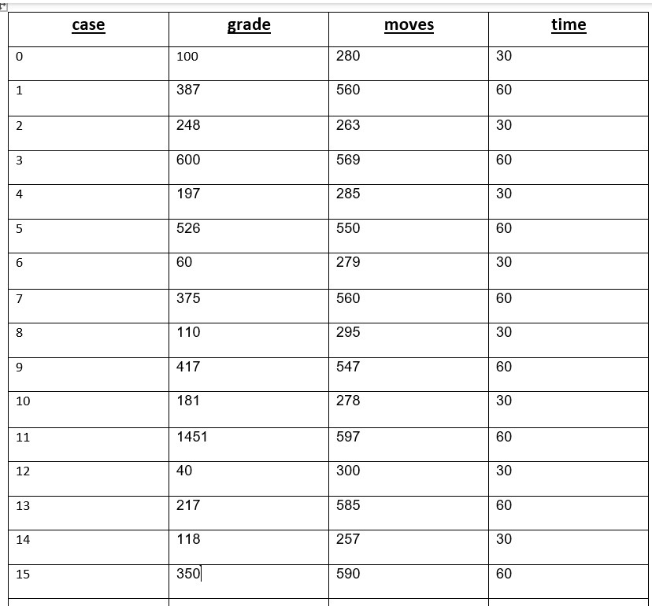

# Pokemon Game In Python
>By Itamar Kraitman & Yuval Bubnovsky

Object-Oriented Programming course @ Ariel University, exercise 4 (and last!)

In this assignment, we were tasked with making a "Pokemon" game, which is basically a directed weighted graph with agents that move and "catch" Pokemon which are sitting on top of the edges of the graph.
<br> As part of the aassignment, we were given a client which communicates with the game server (a script which we run beforehand, hosted on our local machine).<br>
Once everything was set up, we played 16 different secanrios and recorded our performance.

Instructions regarding running the assignment can be found [here](https://docs.google.com/document/d/1LrXIX2pLvRIVHdSqVIimCCxL7UBMaogAcLKfr2dOjHk/edit)

## How To Run
* Download the source code to your local machine
* Install pygame:
```commandline
  pip install pygame
```
* Install pygame-widgets:
```commandline
    pip install pygame-widgets
```
* Once you have all the dependencies set up, you need to start the game-server first as shown below:<br>
scenarios are numbered 0-15
```commandline
    java -jar Ex4_Server_v0.0.jar <YOUR_SCENARIO_NUMBER>
```
* After you set up the server, just run Ex4.py and enjoy the show

## Overview
In this assignment, the main problem that we had to deal with is how to place the Pokemon correctly on the edges of the graph, then, how to make the Agents go to the right Edge and collect the Pokemon - All while keeping the code from sending over 10 move requests per second to not overload the server.<br>
We solved this by using mathematical formulas to calculate each Pokemon's position and calculating the distance from every other node on the graph, once that distance is smaller then a defined epsilon value - we've hit the jackpot and that is the pokemons location.
<br> Once we had all the graph & Pokemon set up, we sent each agent to it's closest Pokemon for quick pick up - we seperated our algorithm for one agent or multiple agents to have everyone synchronized and not chase after the same Pokemon.
UML diagram is uncluded in source files and our results table is below.

## Project Structure

We implemnted the MVC design pattern in this assignment, by having our data structure, logic and graphical interface seperated and each having their designated role while communicating and moving data between one another.<br>

The workspace contains these folders by default, where:

- `src` : contains main, GUI and code logic files
  - `graph`: Contains all graph data structure code
  - `data`: contains some JSON files representing directed weighted graphs
  - `pic_for_ex5`: contains all the pictures used in the GUI
- `tests`: contains all test files

## Results


